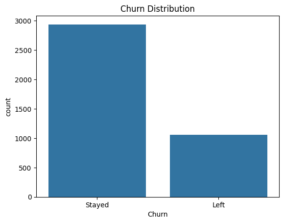
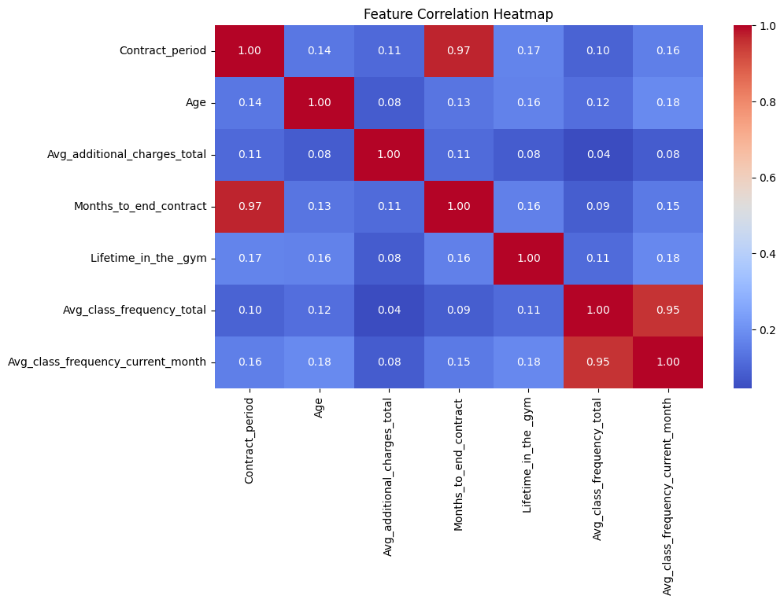
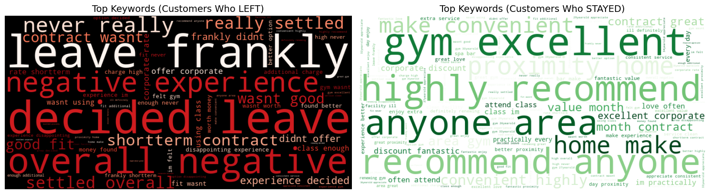
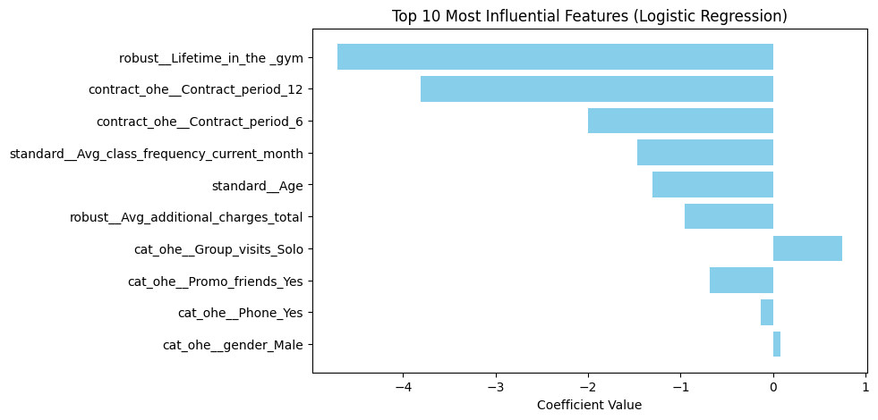
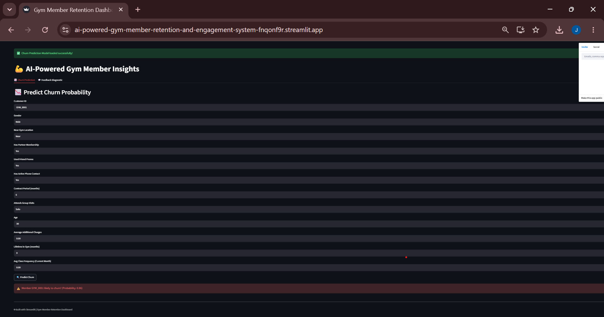

# 💪 AI-Powered Gym Member Retention & Engagement System


A churn-prediction and feedback-diagnostic pipeline built on a 4,000-member gym dataset. The project goes from raw EDA through model comparison, hyperparameter tuning, feature-importance analysis, and an NLP diagnostic layer, deployed as a live Streamlit dashboard — the full path from notebook to a tool a retention team could actually use.

## Project Showcase

🔗 **[Live Demo](https://ai-powered-gym-member-retention-and-engagement-system-fnqonf9r.streamlit.app/)** — The working machine learning application. Try it with your own inputs; no setup required.

📊 **[Project Presentation](https://member-mind-pro.lovable.app/)** — Lovable  Interactive presentation showcasing the business problem, data science approach, model results, and proposed product experience. This was created for the project presentation and is **not** a second deployment of the machine learning model.

🏆 **Recognition:** This project was featured on the **Wall of Fame** at **Zindua School**.

**TL;DR**: The final tuned Logistic Regression model catches **~90% of members who churn** (recall) with strong overall ranking power (**ROC AUC 0.967**), and is paired with an NLP diagnostic layer that reads a member's free-text feedback and routes a specific, churn-status-aware recommendation to the right team.

## Business Problem

Gyms lose recurring revenue every time a member cancels, and by the time churn shows up in the billing system it's too late to act. Unlike a leaderboard exercise, this project is built as a **decision-support tool**: it doesn't just predict who's likely to leave, it diagnoses *why* from their own words and tells a specific team what to do about it — a retention offer, a customer success call, a win-back campaign, or nothing at all if the signal is positive.

## Project Pipeline

```text
Raw Membership Data
    │
    ▼
Exploratory Data Analysis (EDA)
    │
    ▼
Feature Selection & Preprocessing (ColumnTransformer + SMOTE)
    │
    ▼
Model Training & Comparison
    │
    ▼
Hyperparameter Tuning (GridSearchCV)
    │
    ▼
Feature Importance & Business Interpretation
    │
    ▼
NLP Feedback Diagnostic Engine (topic + recommendation)
    │
    ▼
Streamlit Dashboard
    │
    ▼
Deployed App (Streamlit Community Cloud)
```

## Table of Contents
- [Dataset](#dataset)
- [Getting Started](#getting-started)
- [1. Exploratory Data Analysis](#1-exploratory-data-analysis)
- [2. Modeling](#2-modeling)
- [3. NLP Feedback Diagnostic Engine](#3-nlp-feedback-diagnostic-engine)
- [4. Results](#4-results)
- [5. Deployment](#5-deployment)
- [Design Decisions & Known Limitations](#design-decisions--known-limitations)
- [Next Steps](#next-steps)
- [Tech Stack](#tech-stack)

---

## Dataset

- **Source**: gym membership dataset (`gym_raw.csv`), one row per member
- **Size**: 4,000 members, 15 raw features
- **Target**: `Churn` (binary — Left / Stayed), **~26.5% positive class**

| Category | Features |
|---|---|
| Demographics | `gender`, `Age`, `Near_Location` |
| Membership | `Contract_period`, `Partner`, `Promo_friends`, `Phone` |
| Engagement | `Group_visits`, `Lifetime_in_the_gym`, `Avg_class_frequency_current_month` |
| Spend | `Avg_additional_charges_total` |



No missing values, no duplicates. Class imbalance handled with **SMOTE inside the cross-validated pipeline** (applied only to training folds), avoiding the common leakage mistake of oversampling before the train/test split.

## Getting Started

```bash
# Clone the repo
git clone https://github.com/JoyMurengi/AI-Powered-Gym-Member-Retention-and-Engagement-System
cd AI-Powered-Gym-Member-Retention-and-Engagement-System

# --- Option A: Run the notebooks ---
python3 -m venv venv && source venv/bin/activate
pip install -r requirements.txt
jupyter notebook EDA.ipynb

# --- Option B: Run the dashboard locally ---
pip install -r requirements.txt
streamlit run app.py

# --- Option C: Use the deployed app directly ---
# https://ai-powered-gym-member-retention-and-engagement-system-fnqonf9r.streamlit.app/
```

---

## 1. Exploratory Data Analysis

Notebook: [`EDA.ipynb`](EDA.ipynb)

Key findings that shaped the modeling strategy:

- **Redundant features removed based on correlation, not intuition**: `Months_to_end_contract` (r = 0.97 with `Contract_period`) and `Avg_class_frequency_total` (r = 0.95 with the current-month equivalent) were dropped to avoid multicollinearity — keeping the more business-relevant variable in each pair.
- **Strongest churn correlates**: `Lifetime_in_the_gym` (r = -0.44), `Avg_class_frequency_current_month` (r = -0.41), `Age` (r = -0.40), `Contract_period` (r = -0.39). Engagement and tenure dominate over demographics.
- **Categorical signals**: members attending group classes churn far less than solo visitors; members near the gym churn far less than those farther away. Gender showed negligible effect.
- **Not linearly separable** in raw feature space (confirmed via pairplot) — the reason both linear (Logistic Regression, SVM) and non-linear (Random Forest, XGBoost) model families were benchmarked rather than assuming one would win.



## 2. Modeling

Notebook: [`modelling.ipynb`](modelling.ipynb)

### Preprocessing
- `ColumnTransformer`: OneHotEncoding for categoricals + contract period, `RobustScaler` for skewed spend/tenure features, `StandardScaler` for age/class frequency.
- Full pipeline wrapped in `imblearn.Pipeline` (preprocessing → SMOTE → classifier) so resampling only ever sees training folds — never the test set.
- Stratified 80/20 train/test split preserving the ~26.5% churn rate.

### Models trained and compared

Four candidates benchmarked under identical preprocessing. Primary metric: **ROC AUC** (ranking power) alongside **recall** on the churn class, since missing a churner (false negative) costs a lost member while a false positive only costs an unnecessary retention offer.

| Model | Test Accuracy | Precision | Recall | F1 | ROC AUC |
|---|---|---|---|---|---|
| **Logistic Regression (selected)** | **0.9038** | 0.7755 | 0.8962 | 0.8315 | **0.9669** |
| SVM | 0.9000 | 0.7661 | 0.8962 | 0.8261 | 0.9605 |
| Random Forest | 0.9038 | 0.8054 | 0.8396 | 0.8222 | 0.9580 |
| XGBoost | 0.9025 | 0.8102 | 0.8255 | 0.8178 | 0.9559 |


- **Winner: Logistic Regression** — best ROC AUC of the four, and a near-zero train/test gap (0.906 vs. 0.904 accuracy), unlike Random Forest (0.95 train vs. 0.90 test), which pointed to mild overfitting.
- **Hyperparameter tuning**: `GridSearchCV` (5-fold stratified, scored on F1) over penalty/`C`/solver. Best params: `C=10, penalty='l2', solver='saga'` (CV F1 = 0.836). Tuning confirmed the untuned defaults were already near-optimal — reported as-is rather than dressed up as a bigger win than the data supports.

## 3. NLP Feedback Diagnostic Engine

Notebook: [`NLP.ipynb`](NLP.ipynb) · Shared logic: [`lda_recommendations.py`](lda_recommendations.py)

Free-text member feedback is cleaned (lowercased, punctuation-stripped, stopword-removed, lemmatized) and mapped to one of five topics — *Value & Quality, Hard Churn Signal, Usage/Integration Issue, Ambassadors/High Engagement, Neutral/Other* — each paired with a topic- **and** churn-status-specific recommendation. A "Value & Quality" complaint from a member who already left triggers a high-priority win-back offer; the identical complaint from a current member triggers a proactive flight-risk survey instead.

A separate **TF-IDF + Logistic Regression sentiment classifier** trained on the same feedback distinguishes "Left" vs. "Stayed" language at 95% accuracy.

This is the layer that turns a churn *number* into a churn *reason* — closing the loop from "who is at risk" to "what do we actually do about it."



## 4. Results

**Confusion matrix (tuned model, test set, n=800):**

|  | Predicted Stayed | Predicted Left |
|---|---|---|
| **Actual Stayed** | 532 (TN) | 56 (FP) |
| **Actual Left** | 22 (FN) | 190 (TP) |

- **Churn catch rate (recall)**: 89.6% of members who actually churned were correctly flagged
- **False positive rate**: 9.5% of members who stayed were incorrectly flagged
- **ROC AUC**: 0.967 — strong discriminative power between churners and non-churners

**Top feature drivers (logistic regression coefficients):**

| Feature | Coefficient | Direction |
|---|---|---|
| `Lifetime_in_the_gym` | -4.71 | Longer tenure → lower churn |
| `Contract_period` (12 mo) | -3.81 | Annual contracts → lower churn |
| `Contract_period` (6 mo) | -2.00 | Semi-annual → lower churn (vs. 1-month baseline) |
| `Avg_class_frequency_current_month` | -1.47 | More classes attended → lower churn |
| `Age` | -1.30 | Older members → lower churn |
| `Avg_additional_charges_total` | -0.95 | Higher add-on spend → lower churn |
| `Group_visits = Solo` | +0.74 | Solo attendance → higher churn |
| `Promo_friends = Yes` | -0.68 | Friend-referred members → lower churn |



**Takeaway for the business:** churn is overwhelmingly a function of behavior and commitment structure — tenure, contract length, class attendance, social participation — not demographics. This directly shapes who the NLP recommendation engine prioritizes.

## 5. Deployment

- Final pipeline (preprocessing + SMOTE + tuned Logistic Regression) serialized to `tuned_logistic_regression.pkl` via `joblib`.
- Served through a **Streamlit dashboard** (`app.py`) with two tabs:
  - **Churn Prediction** — enter a member's profile, get a churn probability and classification.
  - **Feedback Diagnostic** — paste feedback text, get a topic label and a color-coded, risk-weighted recommended action, pre-filled with the churn status just predicted.
- Deployed live on **Streamlit Community Cloud**: [ai-powered-gym-member-retention-and-engagement-system-fnqonf9r.streamlit.app](https://ai-powered-gym-member-retention-and-engagement-system-fnqonf9r.streamlit.app/)



---

## Design Decisions & Known Limitations

Being upfront about trade-offs and gaps, rather than glossing over them:

- **Feedback data is synthetic**: no real free-text member feedback existed for this dataset, so feedback was generated by a rules-based text generator seeded from each member's true churn status (with a 10% label-flip for noise). This was a deliberate choice to build and validate the full NLP diagnostic architecture end-to-end before real feedback is available — the 95% sentiment-classifier accuracy reflects how well the model recovers a signal it was seeded with, and should be re-validated once real customer feedback is collected.
- **Topic assignment is currently rule-based** (keyword matching), not a fitted LDA model, despite the module name. An actual `LatentDirichletAllocation` topic model was prototyped in `NLP.ipynb` and is the planned replacement — called out explicitly as the top next step rather than left unaddressed.
- **Validation strategy**: the current split is a stratified random train/test split, not an out-of-time split. Member churn drivers could shift over time (seasonality, pricing changes), so an out-of-time validation would give a more realistic production estimate.
- **Decision threshold**: the dashboard uses the default 0.5 probability threshold. In practice, the right threshold is a business decision — how much a missed churner costs vs. how much an unnecessary retention offer costs — and should be tuned against an explicit cost matrix rather than left at the default.

## Next Steps

- Replace the rule-based topic engine with the fitted LDA model already prototyped in `NLP.ipynb`.
- Source or partner-collect real member feedback text to re-validate the NLP layer end-to-end.
- Add out-of-time validation (train on earlier cohorts, validate on later ones) once longitudinal data is available.
- Tie the decision threshold to an explicit cost matrix (cost of a missed churner vs. cost of an unnecessary offer).
- Add SHAP values to the dashboard alongside the raw churn probability, for case-level explainability the retention team can act on directly.
  

## Tech Stack

`Python` · `pandas` / `numpy` · `scikit-learn` · `imbalanced-learn` (SMOTE) · `XGBoost` · `NLTK` · `TF-IDF` · `TensorFlow/Keras`· `Streamlit`

---


## Contact

Built by [Joy](https://github.com/JoyMurengi). Questions or feedback welcome via GitHub issues.
